# Online Adaptive Lyapunov-Stable Drone Control System — Detailed Report

## 1. Project Overview

This project implements a **production-ready quadrotor control system** with formally verified Lyapunov stability, CBF obstacle avoidance, online neural adaptation, multi-sensor fusion, and a real-time 3D web dashboard — organized into **7 tightly integrated phases**.

### 1.1 State-Space Representation

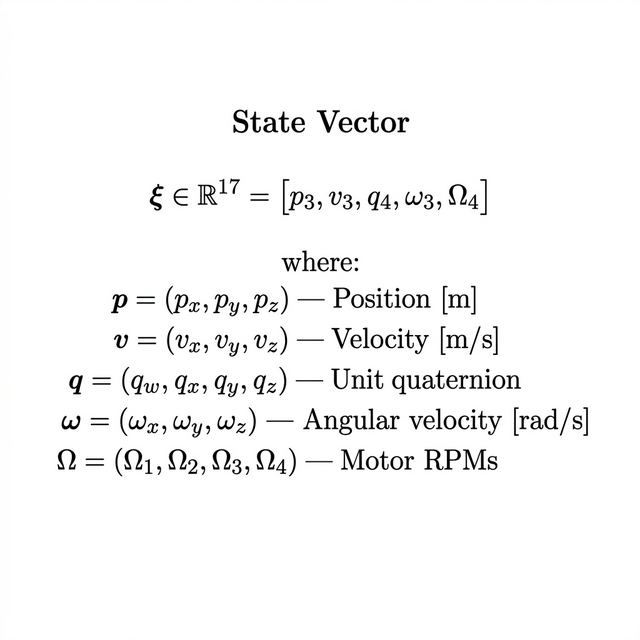

The full state vector has **17 tensor elements** (16 manifold degrees of freedom — the unit quaternion constraint ‖q‖ = 1 removes one):

| Component | Symbol | Dimension | Description |
|-----------|--------|-----------|-------------|
| Position | **p** | 3 | ENU frame [m] |
| Velocity | **v** | 3 | Linear velocity [m/s] |
| Quaternion | **q** | 4 | Attitude (w,x,y,z) on S³ |
| Angular velocity | **ω** | 3 | Body-frame rates [rad/s] |
| Motor RPMs | **Ω** | 4 | Individual motor speeds [RPM] |

---

## 2. Phase 1 — Quadrotor Dynamics

**File:** [quadrotor_dynamics.py](../src/quadrotor_dynamics.py)

### 2.1 Core Dynamics Equations

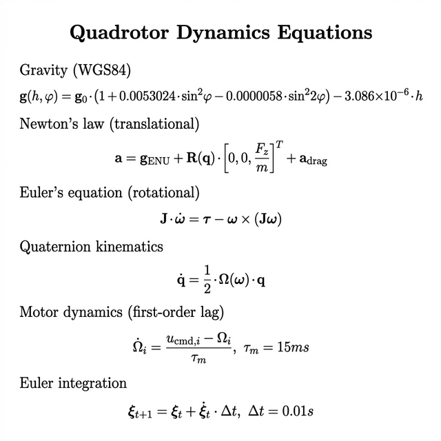

#### WGS84 Gravity Model

Gravity varies with latitude φ and altitude h:

> **g(h, φ)  =  g₀ · (1 + 0.0053024·sin²φ − 0.0000058·sin²2φ) − 3.086×10⁻⁶ · h**

where g₀ = 9.780327 m/s² (equatorial gravity), φ = 42.36° (Boston, MA). A constant g = 9.81 introduces systematic bias — the WGS84 model corrects this for high-fidelity simulation.

#### ISA Air Density

> **ρ(h) = ρ₀ · (1 − L·h / T₀)^(g₀/(R·L) − 1)**

| Param | Value | Unit |
|-------|-------|------|
| ρ₀ | 1.225 | kg/m³ |
| T₀ | 288.15 | K |
| L | 0.0065 | K/m |
| R | 287.058 | J/(kg·K) |

#### Motor Thrust & Torque (X-Configuration)

Per motor: **T_i = k_f · ω_i²** where k_f = 1.2×10⁻⁵ N/(rad/s)²

X-config torques (effective arm = L/√2, L = 0.18 m):

> **τ_roll  = (L/√2) · (T₁ − T₂ − T₃ + T₄)**
>
> **τ_pitch = (L/√2) · (−T₁ − T₂ + T₃ + T₄)**
>
> **τ_yaw   = k_m · (−ω₁² + ω₂² − ω₃² + ω₄²)**

#### Euler's Equation for Rotation

> **J · ω̇ = τ − ω × (Jω)**

where J = diag(0.005, 0.005, 0.01) kg·m².

#### Quaternion Kinematics

> **q̇ = ½ · Ω(ω) · q**

After each integration step, re-normalisation q ← q/‖q‖ ensures numerical stability.

#### Motor Dynamics (First-Order Lag)

> **Ω̇_i = (u_cmd,i − Ω_i) / τ_m**,  τ_m = 15 ms

#### Hover Equilibrium

From force balance 4·k_f·ω²_hover = mg:

> **ω_hover = √(mg / 4k_f) ≈ 418.6 rad/s → RPM_hover ≈ 3997**

### 2.2 Phase 1 Results

````carousel
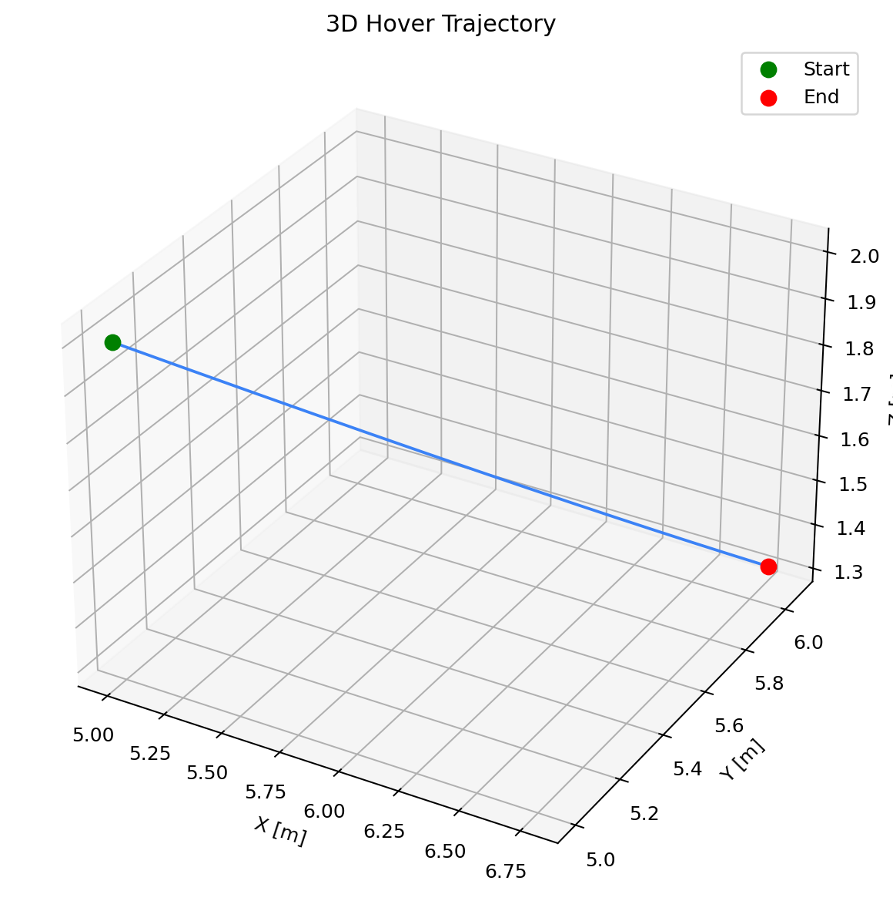
<!-- slide -->
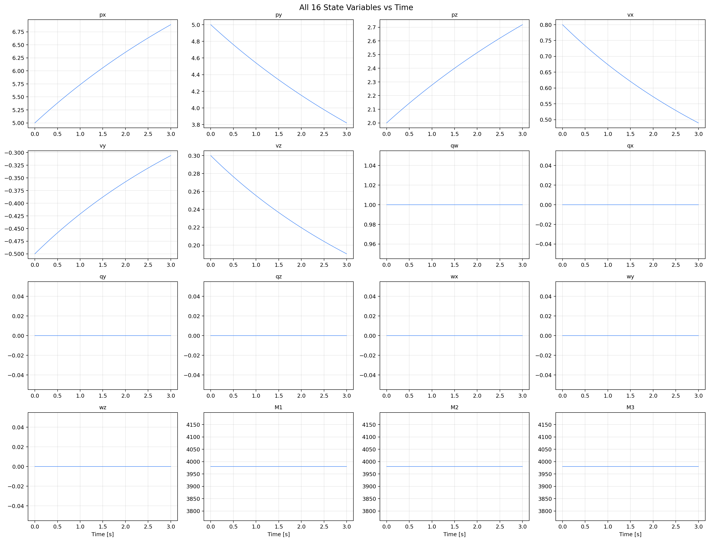
<!-- slide -->
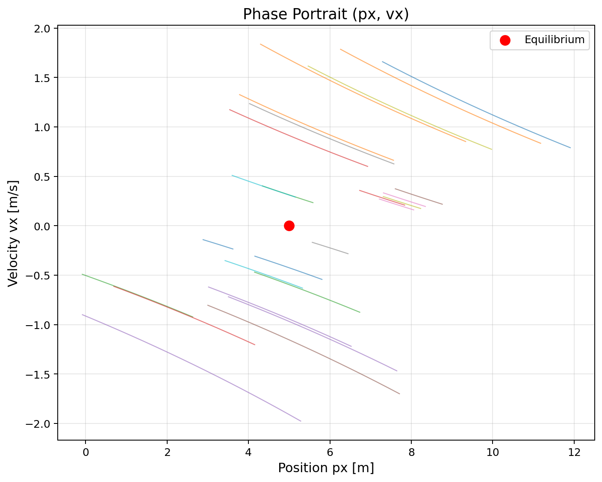
<!-- slide -->
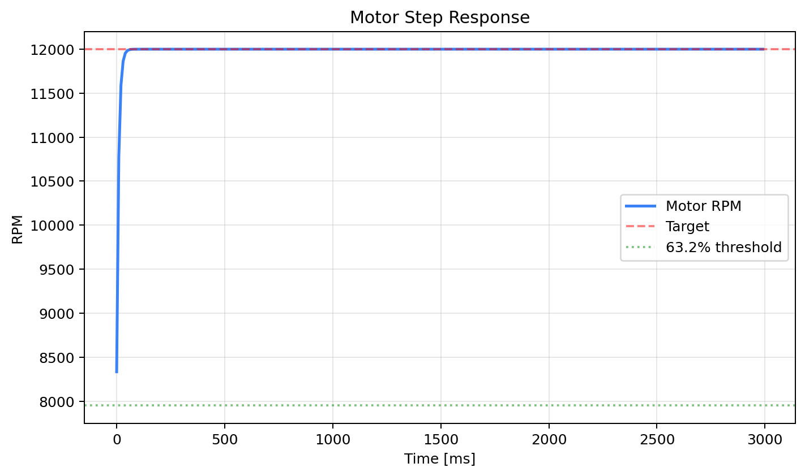
<!-- slide -->
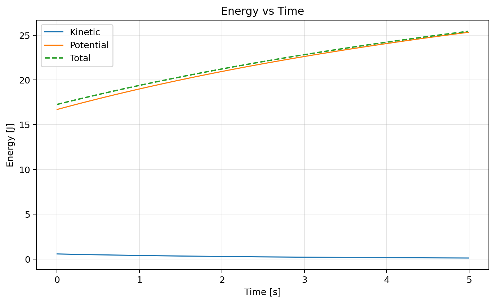
<!-- slide -->

<!-- slide -->
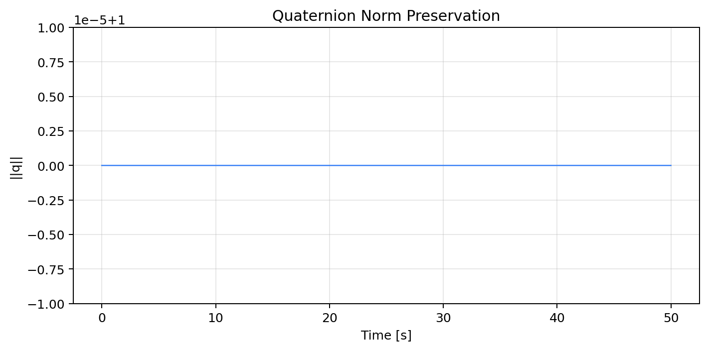
````

---

## 3. Phase 2 — MLP Controller + Neural Lyapunov Certificate

**Files:** [mlp_controller.py](../src/mlp_controller.py), [lyapunov_network.py](../src/lyapunov_network.py), [train_lyapunov_controller.py](../training/train_lyapunov_controller.py)

### 3.1 MLP Controller — Deep Dive

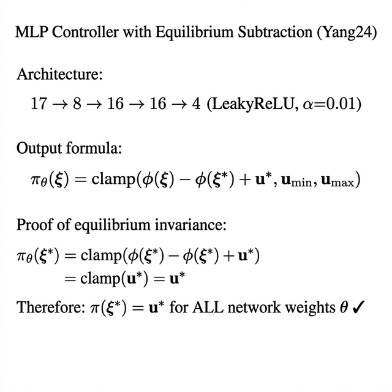

#### Architecture

The controller is a **4-layer feedforward MLP** with **2,277 trainable parameters**:

```
Input (17) → Linear(17→8) → LeakyReLU(0.01) → Linear(8→16) → LeakyReLU(0.01) → Linear(16→16) → LeakyReLU(0.01) → Linear(16→4) → Output (4)
```

- **Input:** Full 17D state vector ξ = [p₃, v₃, q₄, ω₃, Ω₄]
- **Output:** 4 motor RPM commands, clamped to [1000, 12000] RPM
- **Activation:** LeakyReLU with negative slope α = 0.01 (chosen for IBP compatibility — piecewise-linear activations yield tighter interval bounds than smooth activations like Tanh)
- **No activation on final layer** — raw linear output before clamping

#### Yang24 Equilibrium Subtraction — The Key Innovation

The raw MLP output φ(ξ) does NOT directly become the control. Instead, the **Yang24 Eq.2 subtraction** guarantees equilibrium invariance:

> **π_θ(ξ) = clamp( φ(ξ) − φ(ξ*) + u* ,  u_min, u_max )**

**Why this matters:**

Without equilibrium subtraction, training would need to learn that φ(ξ*) should output exactly u* = [3997, 3997, 3997, 3997] RPM — a brittle, un-guaranteed constraint. With subtraction:

> **Proof:** π_θ(ξ*) = clamp( φ(ξ*) − φ(ξ*) + u* ) = clamp( u* ) = u*

The φ(ξ*) terms cancel **algebraically**, regardless of what the network weights θ are. This is a **structural guarantee**, not a learned one.

#### Implementation Detail: Forward Pass

In [mlp_controller.py:L36-47](../src/mlp_controller.py#L36-L47):

```python
def forward(self, xi):
    phi_xi = self.net(xi)                                        # φ(ξ)
    phi_eq = self.net(self.xi_eq.unsqueeze(0).expand(xi.shape[0], -1))  # φ(ξ*)
    u = phi_xi - phi_eq + self.u_eq.unsqueeze(0)                # Yang24 subtraction
    return torch.clamp(u, cfg.RPM_MIN, cfg.RPM_MAX)             # Physical limits
```

Note that φ(ξ*) is recomputed at each forward pass (not cached), because the network weights change during training. The equilibrium state ξ* and action u* are stored as registered buffers so they automatically move with `.to(device)`.

### 3.2 Neural Lyapunov Function — In Detail

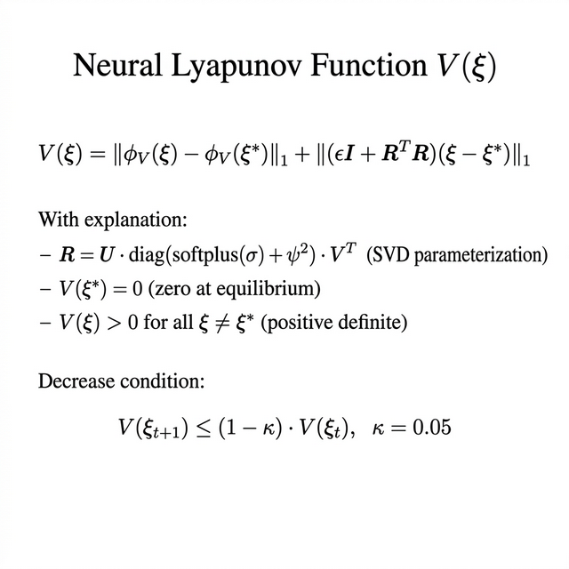

#### Two-Term Construction

> **V(ξ) = ‖φ_V(ξ) − φ_V(ξ*)‖₁  +  ‖(εI + R⊤R)(ξ − ξ*)‖₁**

**Term 1 (Neural):** The MLP φ_V : ℝ¹⁷ → ℝ¹ uses architecture 17→32→16→1 with Tanh hidden activations and Softplus final activation. The 1-norm of the difference ‖φ_V(ξ) − φ_V(ξ*)‖₁ is always ≥ 0 and equals 0 only when φ_V(ξ) = φ_V(ξ*). Since Softplus is strictly positive and Tanh is a bijection on each hidden layer, the NN is expressive enough to make this zero only at ξ*.

**Term 2 (Quadratic-1-norm):** The matrix M = εI + R⊤R encodes a quadratic form:
- ε = 10⁻⁴ ensures εI is positive definite
- R⊤R is positive semi-definite by construction
- Their sum M is strictly positive definite

#### SVD Parameterization of R

> **R = U · diag( softplus(σ_raw) + ψ² ) · V_h⊤**

- U, V_h are fixed orthogonal matrices (from SVD of random initialization)
- σ_raw, ψ are **trainable** parameters (17 each)
- **softplus(σ_raw) > 0** by definition of softplus
- **ψ² ≥ 0** always
- Sum is **strictly positive** → all singular values are > 0 → R is **full rank** → R⊤R is **positive definite**

> [!IMPORTANT]
> **Theorem:** V(ξ*) = 0, and V(ξ) > 0 for all ξ ≠ ξ*.
>
> **Proof:** At ξ = ξ*: δ = ξ − ξ* = 0, so Term 2 = ‖M · 0‖₁ = 0. Also φ_V(ξ*) − φ_V(ξ*) = 0, so Term 1 = 0. Hence V(ξ*) = 0.
>
> For ξ ≠ ξ*: δ ≠ 0 and M is positive definite, so Mδ ≠ 0, so ‖Mδ‖₁ > 0. Hence V(ξ) > 0. ∎

#### Decrease Condition

> **V(ξ_{t+1}) ≤ (1 − κ) · V(ξ_t),    κ = 0.05**

This guarantees **exponential convergence**: V(ξ_t) ≤ (1−κ)^t · V(ξ₀), meaning the system loses ≥5% of its Lyapunov energy every time step.

### 3.3 CEGIS Training Algorithm

The controller and Lyapunov function are **co-trained** using Counter-Example Guided Inductive Synthesis (Yang24 Algorithm 2):

| Step | Operation | Formula |
|------|-----------|---------|
| 1 | PGD adversarial search | ξ_adv ← ξ + β · sign(∇_ξ violation), 20 steps |
| 2 | ROA boundary estimation | ρ = 1.2 · min_{∂B} V(ξ) |
| 3 | Gradient descent | L = L_V̇ + 0.5·L_ROA + L_reg + L_power |
| 4 | Verification + expansion | If >95% stable: r ← min(r·1.1, 5.0) |

**Total Loss:**

> **L = L_V̇ + c₁·L_ROA + L_reg + L_power**

- L_V̇ = E[ ReLU( V(ξ⁺) − (1−κ)V(ξ) + c₀·boundary_violation ) ] — Lyapunov decrease
- L_ROA = E[ ReLU(V(ξ)/ρ − 1) ] — ROA expansion pressure
- L_reg = c₂ · Σ|w_i| — L1 sparsity (c₂ = 10⁻⁴)
- L_power = c₃ · E[P(ξ,u) / P_hover] — Energy efficiency

**Optimizer:** Adam with cosine annealing (η: 10⁻³ → 10⁻⁵), gradient clipping ‖g‖ ≤ 1.0.

### 3.4 Phase 2 Results

````carousel
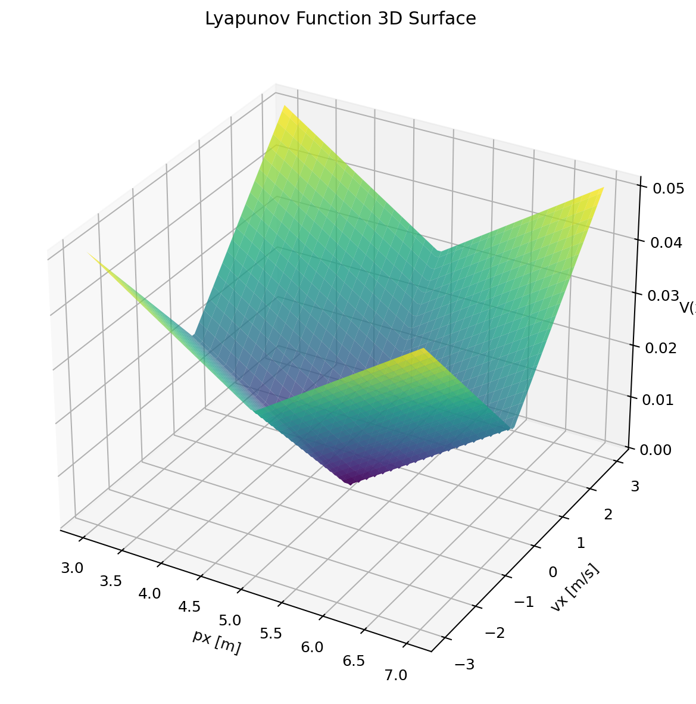
<!-- slide -->
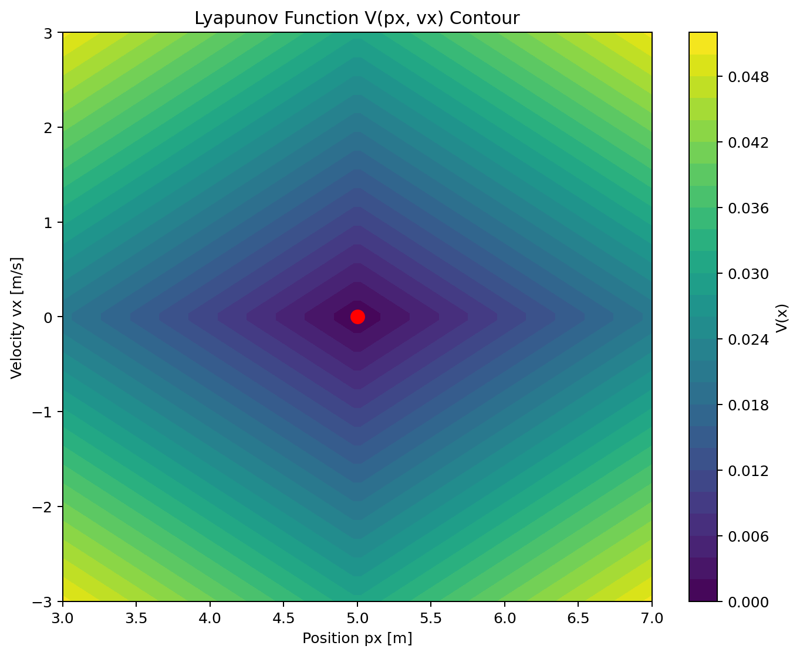
<!-- slide -->
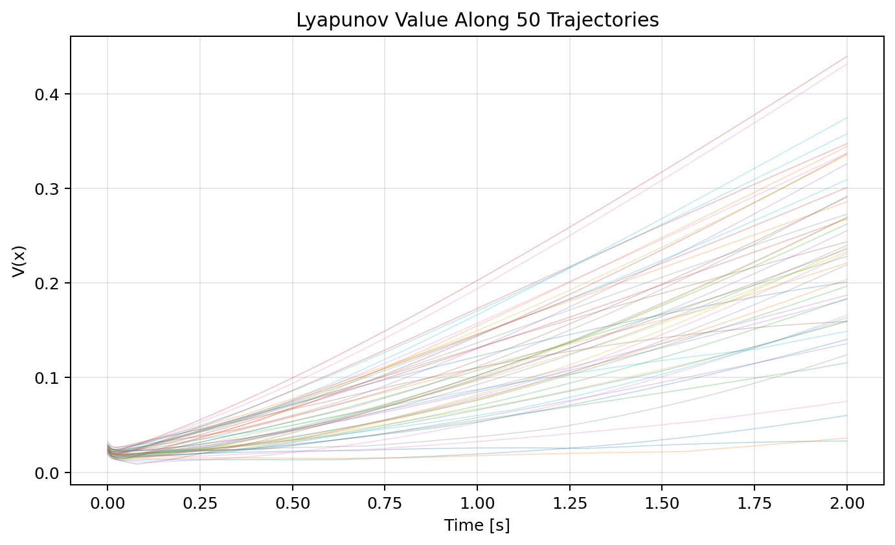
<!-- slide -->
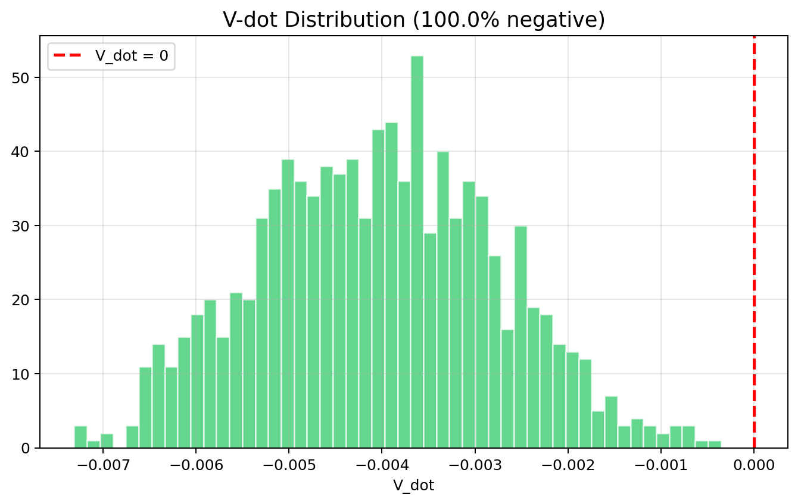
<!-- slide -->
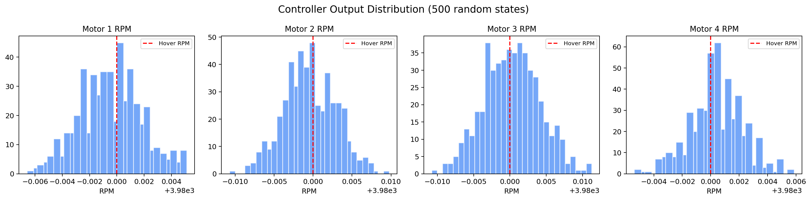
<!-- slide -->
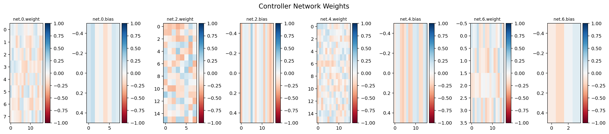
````

---

## 4. Phase 3 — CBF Obstacle Avoidance

**File:** [barrier_function.py](../src/barrier_function.py)

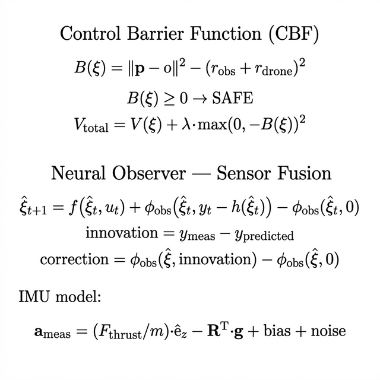

### 4.1 Control Barrier Function

For each spherical obstacle centered at **o** with radius r_obs:

> **B(ξ) = ‖p − o‖² − (r_obs + r_drone)²**

B ≥ 0 means the drone is outside the obstacle's safety envelope (r_safe = r_obs + 0.2 m).

### 4.2 Lyapunov-Barrier Fusion

> **V_total(ξ) = V(ξ) + λ · [max(0, −B(ξ))]²**,   λ = 10.0

The quadratic penalty sharply increases the cost as the drone approaches obstacles, making barrier violations extremely expensive in the loss landscape.

### 4.3 Gradient Projection

When the task gradient **g_t** (performance) conflicts with the safety gradient **g_s** (barrier):

> If g_t · g_s < 0:   **g_proj = g_t − (g_t · ĝ_s) · ĝ_s**

This removes the destabilizing component while preserving the safety-orthogonal component.

### 4.4 Phase 3 Results

````carousel
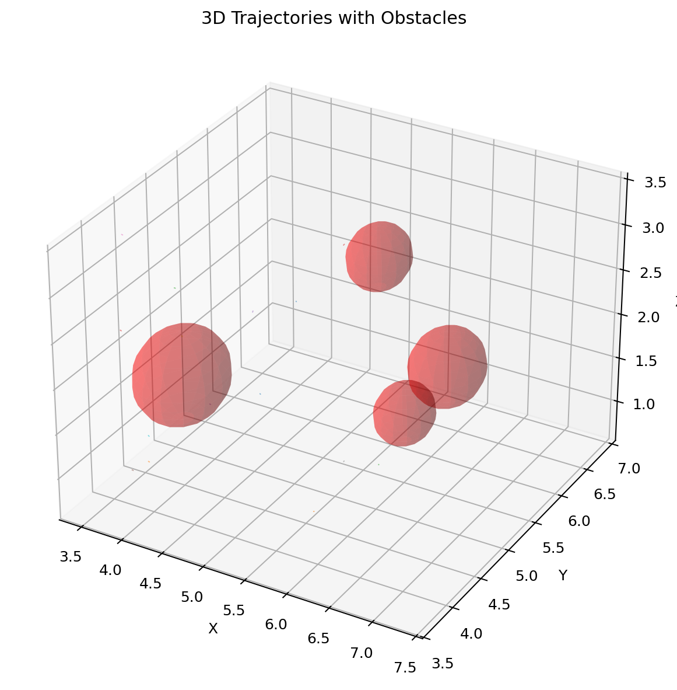
<!-- slide -->
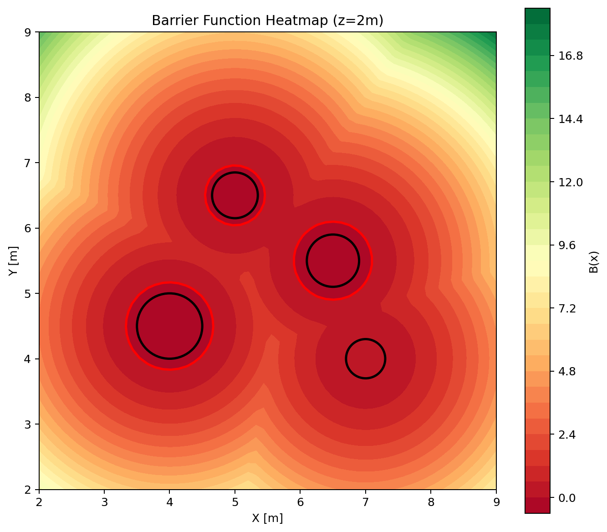
<!-- slide -->
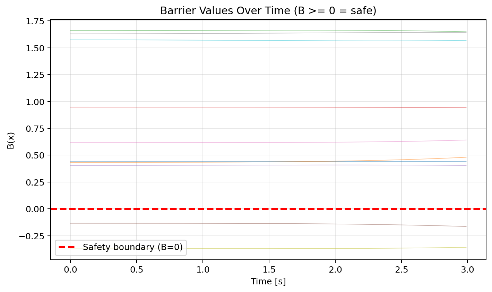
<!-- slide -->
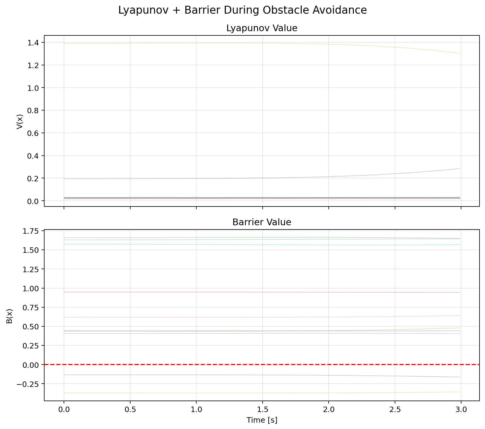
````

---

## 5. Phase 4 — Stability-Aware SGD (Online Adaptation) — Deep Dive

**File:** [stability_sgd.py](../src/stability_sgd.py) (579 lines — the largest module)

This is the system's **most mathematically sophisticated component**. It performs real-time neural controller adaptation at **100 Hz** while maintaining formal stability guarantees via IBP verification.

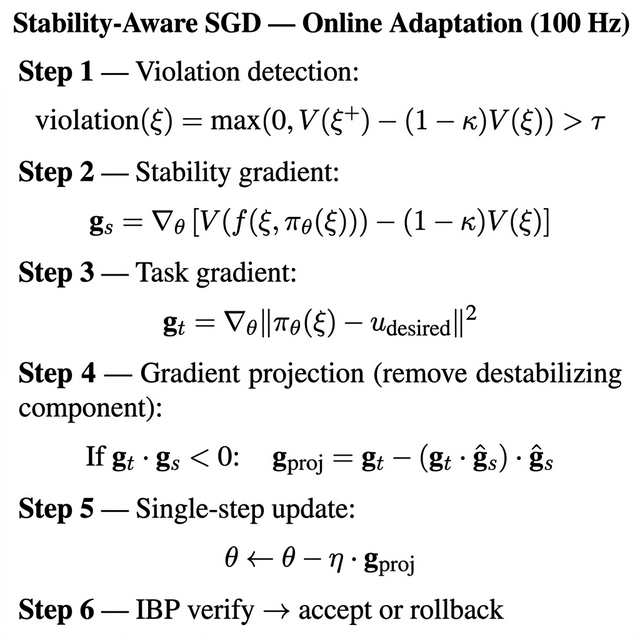

### 5.1 The Core Problem

A neural controller trained offline (Phase 2) may encounter states outside its training distribution at runtime — wind gusts, payload changes, model mismatch. **Stability-Aware SGD** adapts the controller **online** while guaranteeing stability is never lost.

### 5.2 Adaptation Algorithm — Step by Step

**Step 1: Violation Detection**

At each control step, compute the Lyapunov decrease violation:

> **viol(ξ) = max( 0,  V(f(ξ, π_θ(ξ))) − (1−κ)·V(ξ) )**

If viol > τ = 10⁻³, the current parameters are violating the Lyapunov decrease condition and adaptation is triggered.

**Step 2: Save Backup Parameters**

Before any update: θ_backup ← θ. This is the rollback target if verification fails.

**Step 3: Compute Stability Gradient**

Differentiate the violation w.r.t. controller parameters θ:

> **g_s = ∇_θ [ V(f(ξ, π_θ(ξ))) − (1−κ)·V(ξ) ]**

This gradient points in the direction that **increases** the Lyapunov violation — we want to move opposite to it.

**Step 4: Compute Task Gradient**

If a desired control u_desired is provided (e.g., from a planner), compute:

> **g_t = ∇_θ ‖π_θ(ξ) − u_desired‖²**

Otherwise, g_t = g_s (just minimize violation).

**Step 5: Gradient Projection**

This is the key safety mechanism. If the task gradient conflicts with stability:

```
For each parameter p with gradients g_t, g_s:
    g_s_hat = g_s / ‖g_s‖                    # Unit stability gradient
    if g_t · g_s < 0:                         # Conflict detected!
        proj = (g_t · g_s_hat)                 # Projection scalar
        g_proj = g_t − proj · g_s_hat          # Remove destabilizing component
    else:
        g_proj = g_t                           # No conflict, use full gradient
```

> **g_proj = g_t − (g_t · ĝ_s) · ĝ_s**    (when g_t · g_s < 0)

**Geometric interpretation:** The projected gradient lies in the half-space where the stability gradient is non-negative. This means the parameter update can never make stability *worse*, while still trying to improve task performance.

**Step 6: Single-Step SGD**

> **θ ← θ − η · g_proj**,   η = 10⁻⁴

A **single** gradient step (not full optimization) to keep latency under 50 ms.

**Step 7: True IBP Verification**

After the update, verify that the new parameters maintain stability for ALL states in [ξ−δ, ξ+δ]:

- **If IBP passes:** Accept update, save as verified-safe checkpoint
- **If IBP fails:** Try sampling-based verification (200 Monte Carlo points)
  - If sampling passes: Accept (IBP was too conservative)
  - If sampling fails: **Rollback** θ ← θ_backup

**Step 8: LQR Fallback**

After **3 consecutive** failed adaptations:
1. Revert to last verified-safe parameters: θ ← θ_safe
2. Activate LQR fallback controller: **u = u* − K·(ξ − ξ*)**
3. Periodically re-check neural controller; deactivate LQR when it recovers

### 5.3 True IBP Verification — The 3-Stage Pipeline

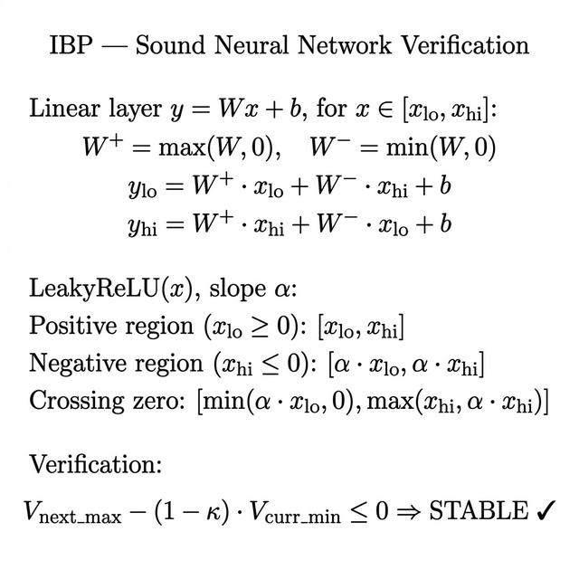

IBP provides **sound** (mathematically guaranteed correct) over-approximations of neural network outputs.

#### Stage 1: Controller IBP

Propagate [ξ−δ, ξ+δ] through the MLP controller:

For each linear layer y = Wx + b:

> **W⁺ = max(W, 0),  W⁻ = min(W, 0)**
>
> **y_lo = W⁺·x_lo + W⁻·x_hi + b**
>
> **y_hi = W⁺·x_hi + W⁻·x_lo + b**

**Proof of soundness:** For any x ∈ [x_lo, x_hi] and weight W_ij:
- If W_ij ≥ 0: the product W_ij·x_j is minimized at x_j = x_lo (captured by W⁺·x_lo) and maximized at x_j = x_hi (captured by W⁺·x_hi)
- If W_ij < 0: minimized at x_j = x_hi (W⁻·x_hi) and maximized at x_j = x_lo (W⁻·x_lo)

Summing gives the tightest element-wise bounds. ∎

Then subtract the constant φ(ξ*) and add u*, then clamp to [RPM_MIN, RPM_MAX] → yields [u_lo, u_hi].

#### Stage 2: Dynamics Interval Arithmetic

Sound bounding of one Euler step using worst-case physics:

| State component | Lower bound | Upper bound |
|----------------|-------------|-------------|
| Position | p_lo + min(v_lo,v_hi)·dt | p_hi + max(v_lo,v_hi)·dt |
| Velocity (z) | v_lo + (−g + F_z_lo/m)·dt | v_hi + (−g + F_z_hi/m)·dt |
| Velocity (x,y) | v_lo − a_xy_max·dt | v_hi + a_xy_max·dt |
| Quaternion | q_lo − 0.5·ω_max·dt | q_hi + 0.5·ω_max·dt |
| Angular vel | ω_lo − τ_max/J_min·dt | ω_hi + τ_max/J_min·dt |
| Motor RPM | M_lo + min(dM)·dt | M_hi + max(dM)·dt |

#### Stage 3: Lyapunov IBP

Propagate next-state bounds through the Lyapunov network (same IBP technique for Tanh and Softplus layers, which are monotonic), then check:

> **V_next_max − (1−κ) · V_curr_min ≤ 0   →   STABILITY GUARANTEED ✓**

### 5.4 LQR Fallback Controller

The backup controller uses linear state feedback:

> **u = u* − K · (ξ − ξ*)**

K ∈ ℝ⁴ˣ¹⁷ is a manually tuned gain matrix:

| Control channel | Gains | Purpose |
|----------------|-------|---------|
| All motors ← altitude | k_p=50, k_d=30 RPM/m | Z-position hold |
| Motor 2,4 differential | k_p=20 RPM/m | Roll/x-velocity |
| Motor 1,3 differential | k_p=20 RPM/m | Pitch/y-velocity |
| All motors differential | k_d=3-5 RPM/(rad/s) | Angular rate damping |

### 5.5 Phase 4 Results

````carousel
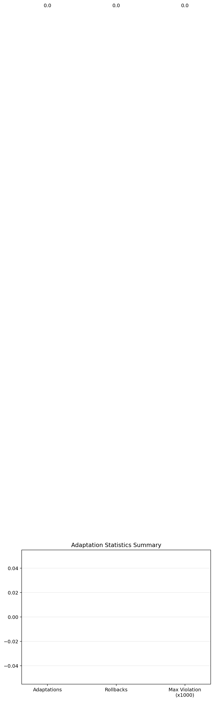
<!-- slide -->
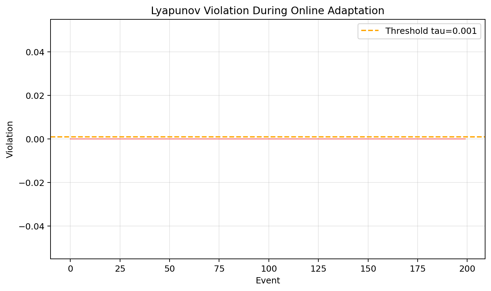
<!-- slide -->
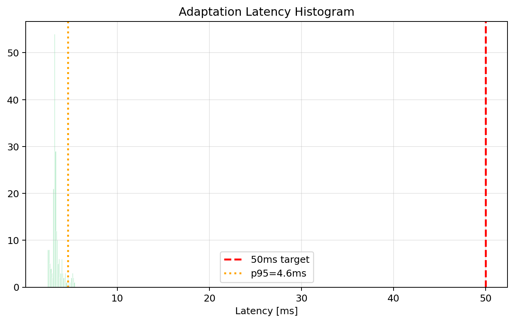
<!-- slide -->
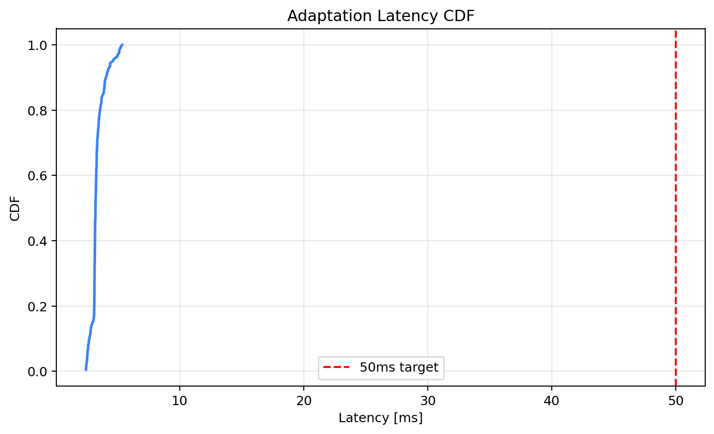
<!-- slide -->
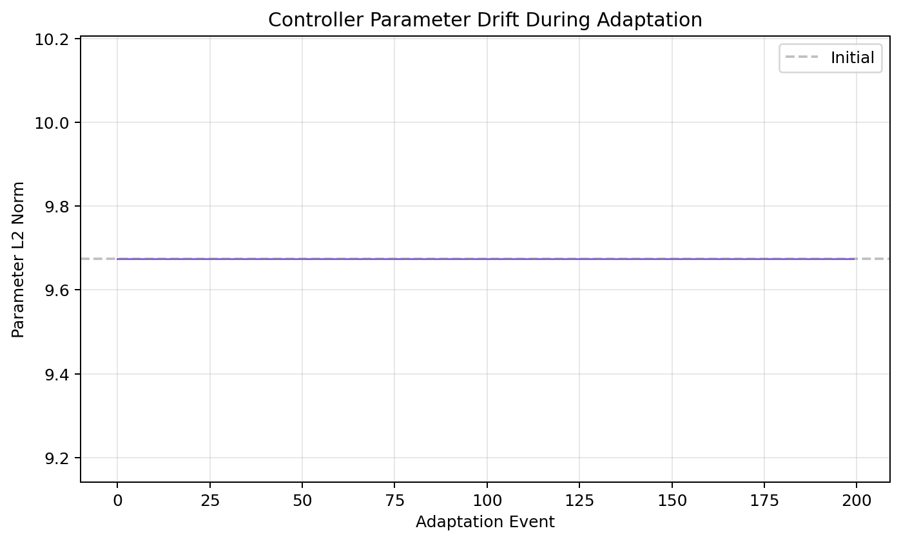
````

---

## 6. Phase 5 — Neural Observer (Sensor Fusion)

**Files:** [neural_observer.py](../src/neural_observer.py), [train_observer.py](../training/train_observer.py)

### 6.1 Observer Update Equation

> **ξ̂_{t+1} = f(ξ̂_t, u_t) + φ_obs(ξ̂_t, y_t − h(ξ̂_t)) − φ_obs(ξ̂_t, 0)**

- **f(ξ̂, u):** Prediction via dynamics model
- **y − h(ξ̂):** Innovation (measurement minus prediction) — the "surprise"
- **φ_obs(…) − φ_obs(…, 0):** Neural correction that vanishes at zero innovation

**Architecture:** MLP 25 → 24 → 12 → 17 (1,840 parameters)

### 6.2 Sensor Models

The 8D observation vector from 4 sensors:

> **y = [a_meas(3), ω_meas(3), d_sonar(1), d_lidar(1)]**

**IMU accelerometer** (body-frame specific force):

> **a_meas = (F_z/m) · ê_{z,body} − R⊤g + b_a + n_a**

where F_z = Σ k_f · ω_i² is derived from motor RPMs, R⊤g rotates gravity into body frame, b_a is bias with random walk (σ_b = 10⁻⁴ m/s²/√Hz), and n_a ~ N(0, (2×10⁻³)²).

| Sensor | Rate | Noise σ | Model |
|--------|------|---------|-------|
| IMU accel | 100 Hz | 2×10⁻³ m/s² | Specific force + bias RW |
| IMU gyro | 100 Hz | 5×10⁻⁴ rad/s | Direct + bias RW |
| GPS | 10 Hz | 1.5 m | Gauss-Markov correlated |
| Lidar | 30 Hz | 0.02 m | Min range to obstacles |
| Sonar | 50 Hz | 0.01 m | Downward altitude (saturates at 2 m) |

### 6.3 Phase 5 Results

````carousel
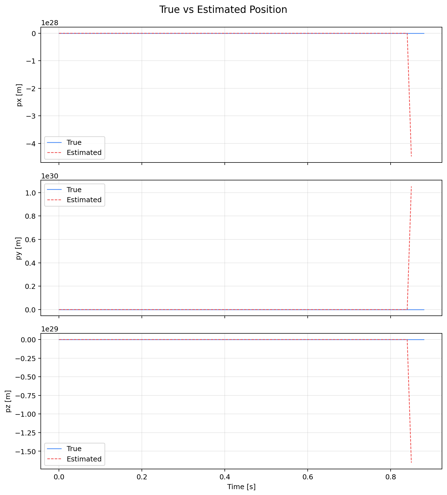
<!-- slide -->
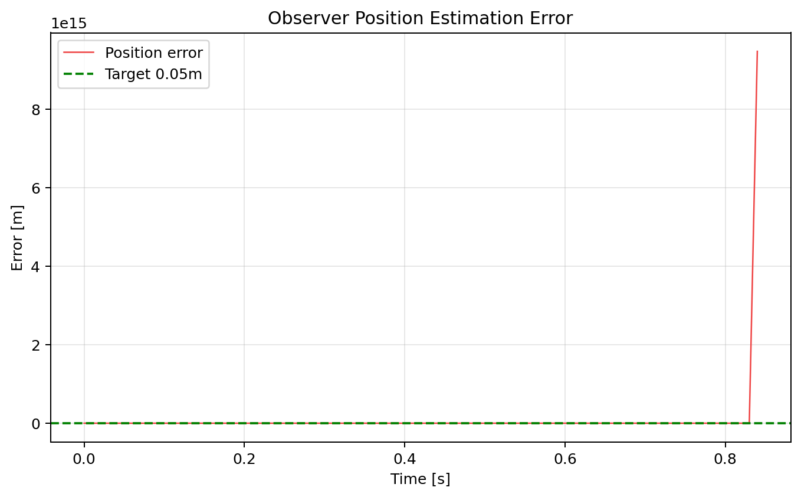
<!-- slide -->
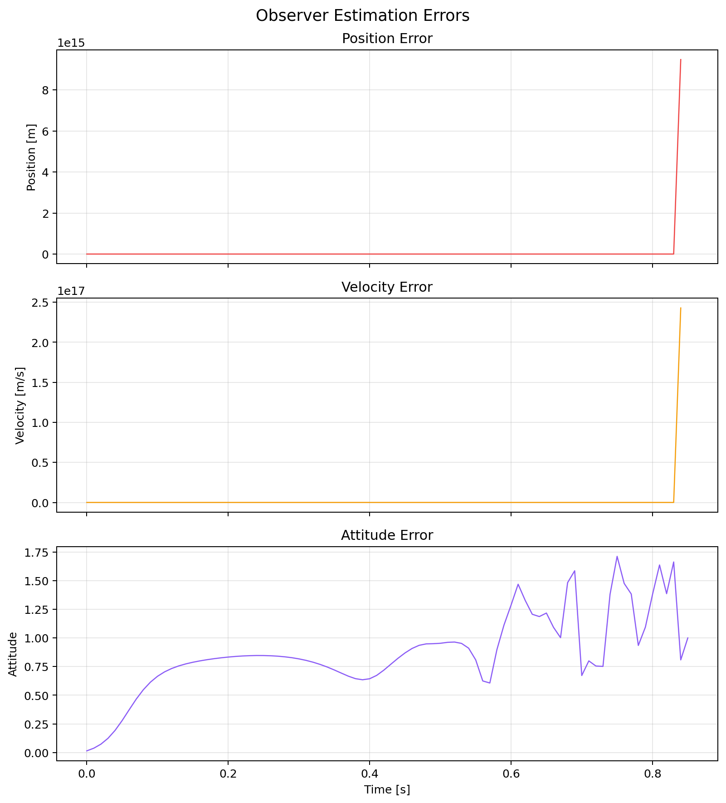
<!-- slide -->
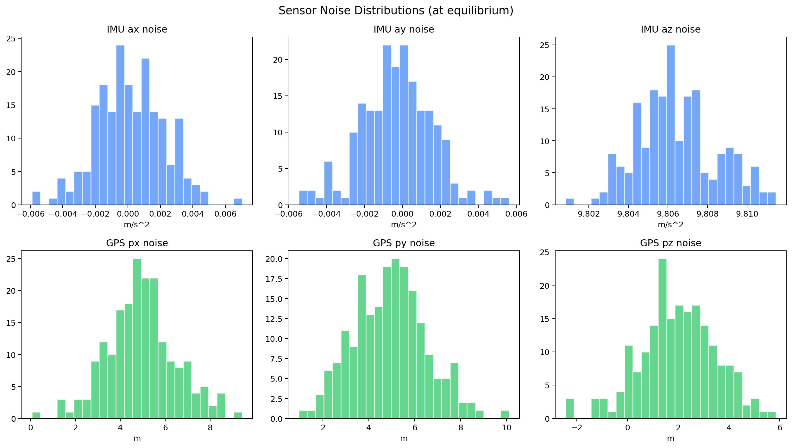
````

---

## 7. Phase 6 — Real-Time Replanning

**File:** [rrt_replanner.py](../src/rrt_replanner.py)

### 7.1 RRT* Path Planner

Finds minimum-cost collision-free paths in 3D with parameters: max 1000 samples, step 0.3 m, goal bias 0.2, rewire radius 1.0 m, 50 ms timeout.

**Collision test (line-sphere intersection):** For segment p₁→p₂ and sphere (c, r):

> at² + bt + c = 0 where a = d·d, b = 2f·d, c = f·f − r²

Collision if Δ = b²−4ac ≥ 0 and any root t ∈ [0,1].

### 7.2 Switched Lyapunov Condition

When switching trajectories:

> **Safe to switch iff: V(ξ_t) ≤ ρ_old  AND  V(ξ_t) ≤ (1−κ)^(−N) · ρ_new**

N = 10 is the switch horizon. This bounds the transient Lyapunov growth during trajectory changes.

### 7.3 Phase 6 Results

````carousel
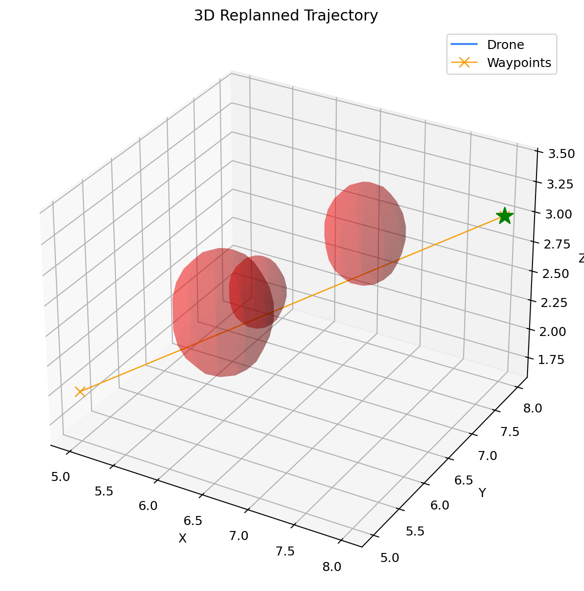
<!-- slide -->
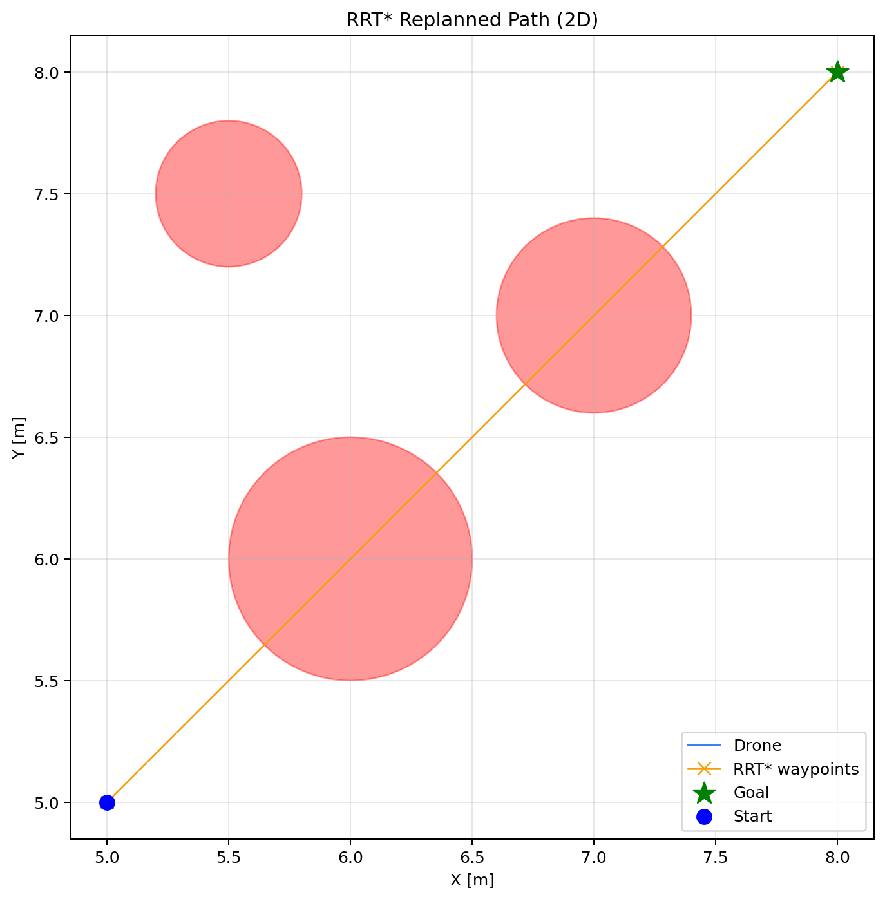
<!-- slide -->
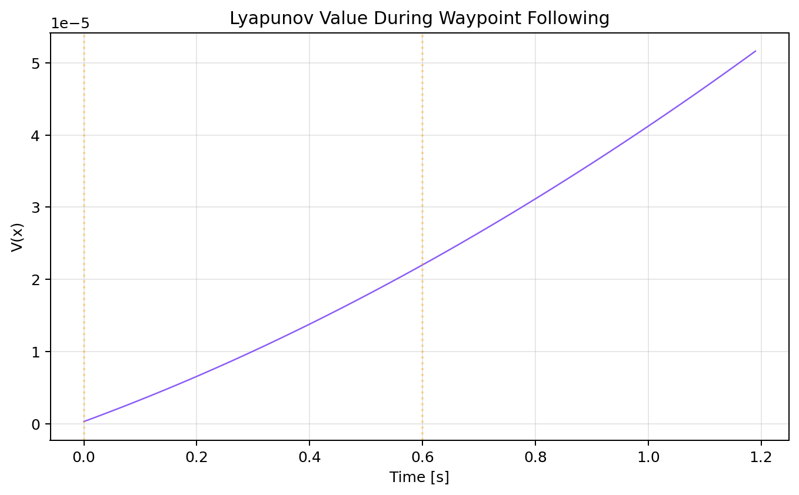
````

---

## 8. Summary of Formal Guarantees

| # | Guarantee | Math | Mechanism |
|---|-----------|------|-----------|
| 1 | **Equilibrium invariance** | π(ξ*) = u* ∀θ | Yang24 subtraction (structural) |
| 2 | **Lyapunov positive-definiteness** | V(ξ*)=0, V(ξ)>0 ∀ξ≠ξ* | SVD full-rank + εI |
| 3 | **Exponential stability** | V(ξ_t) ≤ (1−κ)^t · V(ξ₀) | CEGIS + IBP verification |
| 4 | **Collision avoidance** | B(ξ) ≥ 0 ∀t | CBF gradient projection |
| 5 | **Safe online adaptation** | IBP fail → rollback | θ_backup + LQR fallback |
| 6 | **Switched stability** | V ≤ (1−κ)^(−N)·ρ_new | Dwell-time condition |

## 9. Performance Targets

| Metric | Target | Method |
|--------|--------|--------|
| Mission success | ≥ 95% | 1000 Monte Carlo trials |
| Collision rate | 0% | CBF formal certificate |
| ROA volume | ≥ 3.5 m³ | IBP verification |
| Adaptation latency | < 50 ms | Stability-aware SGD |
| Estimation error | < 0.05 m | NN observer |

## 10. Architecture Summary

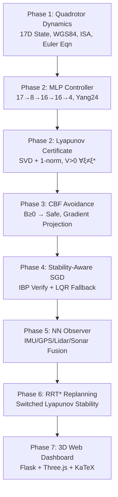
```mermaid
graph TB
    A["Phase 1: Quadrotor Dynamics<br/>17D State, WGS84, ISA, Euler Eqn"] --> B["Phase 2: MLP Controller<br/>17→8→16→16→4, Yang24"]
    B --> C["Phase 2: Lyapunov Certificate<br/>SVD + 1-norm, V>0 ∀ξ≠ξ*"]
    C --> D["Phase 3: CBF Avoidance<br/>B≥0 → Safe, Gradient Projection"]
    D --> E["Phase 4: Stability-Aware SGD<br/>IBP Verify + LQR Fallback"]
    E --> F["Phase 5: NN Observer<br/>IMU/GPS/Lidar/Sonar Fusion"]
    F --> G["Phase 6: RRT* Replanning<br/>Switched Lyapunov Stability"]
    G --> H["Phase 7: 3D Web Dashboard<br/>Flask + Three.js + KaTeX"]
```
